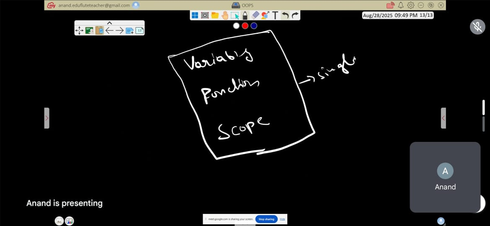

## Day 1 class 

> creating the class and object

#### creating class 
```python

class Student:
    def __init__(self,name,age):
        self.name=name
        self.age=age
    def show_details(self):
        print(self.name)
        print(self.age)
Student1=Student("Naveen",22) # creating the object
print(Student1.name,end=" ")
print(Student1.age)
Student1.show_details()

```



<p> THis three in  sinGle name is called object 

```python

class Bank:
    def __init__(self,balance):
        self.balance=balance
    def deposit(self,amount):
        self.balance+=amount
        return self.balance
    def withdraw(self,amount):
        if(self.balance>amount):
            self.balance-=amount
            return self.balance
Cust=Bank(0)
print(Cust.deposit(123))
print(Cust.withdraw(23))

```


# class notes

# 🔹 Object-Oriented Programming (OOP) in Python

## What is OOP?
**OOP (Object-Oriented Programming)** is a way of writing programs by bundling **data (attributes)** and **behavior (methods)** into **objects**.  
Instead of just writing functions and variables separately, OOP organizes them into **classes** (blueprints) and **objects** (real instances).  

👉 Think of a **class** like a blueprint of a car.  
👉 An **object** is an actual car made from that blueprint.  

### Core Concepts of OOP
- **Class** → Blueprint (Car design).  
- **Object** → Instance (Your Honda City, my Swift).  
- **Encapsulation** → Wrapping data + functions together.  
- **Inheritance** → Child class inheriting from parent class (e.g., ElectricCar from Car).  
- **Polymorphism** → Same method behaving differently (e.g., `drive()` for Car vs `drive()` for Bike).  
- **Abstraction** → Hiding unnecessary details (you drive without knowing engine internals).  

---

## Why OOP in Python?
Python is a **multi-paradigm language** → you can write **procedural code**, **functional code**, or **OOP code**.  

OOP in Python is powerful because:  
1. **Code reusability** → Write once, reuse with inheritance.  
2. **Organization** → Helps manage big projects (instead of 1000s of random functions).  
3. **Real-world modeling** → Maps naturally to real-world problems (e.g., students, employees, bank accounts).  
4. **Scalability** → Easy to extend with new classes & methods.  
5. **Libraries/frameworks** → Most Python frameworks (Django, Flask, Tkinter, etc.) are OOP-based.  

---

## Procedural vs OOP (Side-by-side)

| Feature              | Procedural Programming | Object-Oriented Programming |
|----------------------|------------------------|-----------------------------|
| **Style**            | Functions + data are separate | Functions + data bundled into objects |
| **Reusability**      | Harder, need to copy functions | Easy with inheritance & polymorphism |
| **Structure**        | Sequential execution | Class-based modular structure |
| **Best for**         | Small scripts, simple tasks | Large, complex, scalable systems |
| **Example (Bank)**   | Functions for deposit, withdraw | `BankAccount` class with methods |

---


```python

class Bankdetails:
    def __init__(self):
        self.balance=0
    def deposit(self,amount):
        self.balance+=amount
    def withdraw(self,amount):
        if(amount>self.balance):
            print("balance is only ",self.balance)
        else:
            self.balance-=amount
    def show(self):
        print(self.balance)
cust=Bankdetails()
cust.deposit(67)
cust.withdraw(60)
cust.show()

```