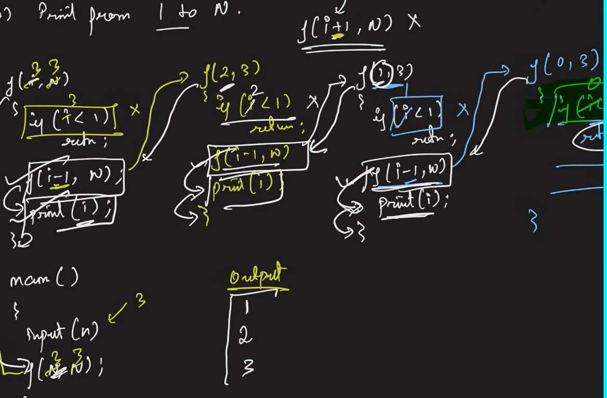

## Recursion Example 

#### Example 1

```python
def f():
    print(1)
    f()
f()

```

### Example 2
```python

count=0
def f():
    global count
    if(count==4):
        return
    print(count)
    count+=1
    f()
f()

```
### Example 3

> Print the name 5 times

```python
name_count=1
def f():
    global name_count
    if(name_count==6):
        return 
    print("Naveen")
    name_count+=1
    f()
f()
```
### Model 2
> Print the names N times
```python
def f(i,j):
    if(i>j):
        return
    print("Naveen")
    f(i+1,j)
n=int(input())
f(1,n)
```

### Example 4

> Print Liner 1 to N

```python
def f(i,n):
    if(i>n):
        return
    print(i)
    f(i+1,n)
n=int(input())
f(1,n)
```

### Example 5

> Print from N to 1

```python
def f(i,j):
    if(i>j):
        return
    print(j)
    f(i,j-1)
f(1,5)
```

### Example 6

> print Liner from 1 to N
- Without using the (i+1) in the code 

```python
def f(i,j):
    if(i<1):
        return
    f(i-1,j)
    print(i)
f(3,3)
```



### Example 7

> Print the number N to 1
- Using Back Tracking

```python

def f(i,j):
    if j<i:
        return
    f(i+1,j)
    print(i)
f(1,5)

```